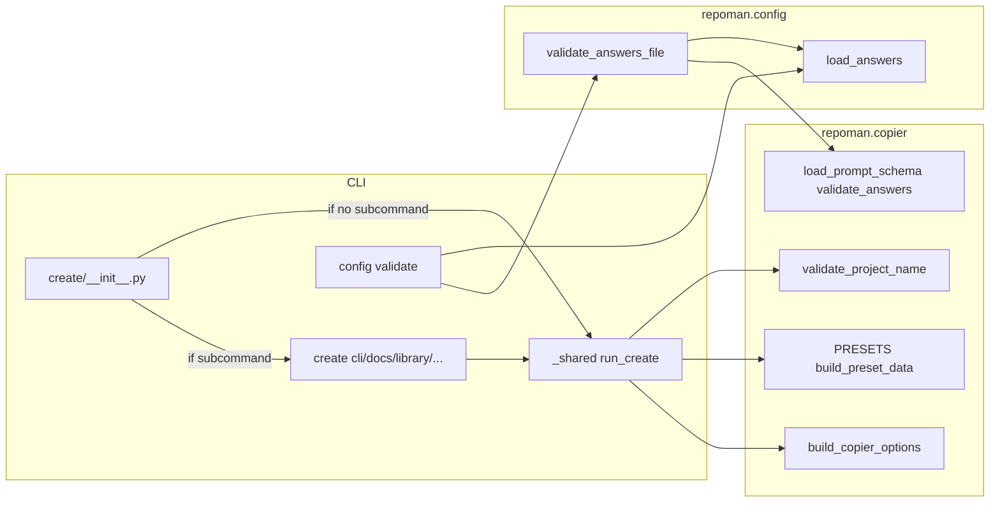

# Create and config architecture

This page describes how the **create** command and **config validate** flow are structured: the CLI layer delegates to two core modules, `repoman.copier` (template and copy operations) and `repoman.config` (project configuration and answers loading).

## Summary diagram

The diagram shows how the create group, its subcommands, and config validate use the shared modules.

- **repoman.copier**: Template schema, validation (answers vs schema), presets, and options for running Copier (`validate_project_name`, `build_preset_data`, `build_copier_options`, `load_prompt_schema`, `validate_answers`).
- **repoman.config**: Loading the project’s answers file (`load_answers`) and optional orchestration such as `validate_answers_file` (load + schema + validate).
- **Create**: When no subcommand is given, the create callback runs the default flow via `run_create`; when a subcommand is used (e.g. `create cli`), only that subcommand runs, and it calls `run_create` with the right preset.
