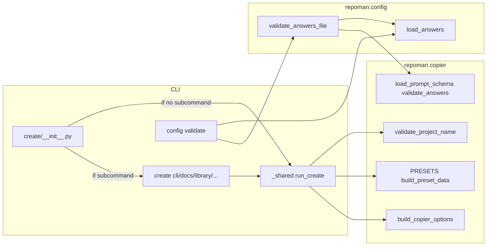
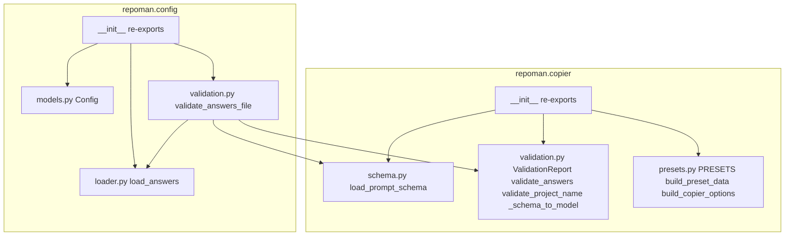

# Create and config architecture

This page describes how the **create** command and **config validate** flow are structured: the CLI layer delegates to two core modules, `repoman.copier` (template and copy operations) and `repoman.config` (project configuration and answers loading).

## Summary diagram

The diagram shows how the create group, its subcommands, and config validate use the shared modules. The **update** and **generator add** commands are not shown; see the Update and generator section below.

- **repoman.copier**: Template schema, validation (answers vs schema), presets, and options for running Copier (`validate_project_name`, `build_preset_data`, `build_copier_options`, `load_prompt_schema`, `validate_answers`).
- **repoman.config**: Loading the project’s answers file (`load_answers`) and optional orchestration such as `validate_answers_file` (load + schema + validate).
- **Create**: When no subcommand is given, the create callback runs the default flow via `run_create`; when a subcommand is used (e.g. `create cli`), only that subcommand runs, and it calls `run_create` with the right preset.

## Package submodules

Implementation is split into submodules; the public API is unchanged (import from `repoman.config` and `repoman.copier`).

- **config/models.py**: `Config` (Pydantic model).
- **config/loader.py**: `load_answers(path)` — load YAML answers file.
- **config/validation.py**: `validate_answers_file(path, template_path, *, strict)` — load answers, then validate via copier schema.
- **copier/schema.py**: `load_prompt_schema(template_path)` — load prompt keys from copier.yml.
- **copier/validation.py**: `ValidationReport`, `validate_answers`, `validate_project_name`, and internal `_schema_to_model`.
- **copier/presets.py**: `PRESETS`, `build_preset_data`, `build_copier_options`.

## Update and generator

- **update**: The `repoman update` command re-runs Copier on an existing project. It reads the project’s `.copier-answers.yml` (or the path given by `--answers`), optionally overrides template path or VCS ref, and calls Copier to apply the template again. The CLI does not use `repoman.copier` presets or `run_create`; it invokes Copier directly with the project as destination. This fits alongside create and config: same answers file and template, different flow (update in place vs. create new).
- **generator add**: The `repoman generator add <command_name>` command adds a new CLI command to a repoman-generated project. It uses the **command template** under `src/repoman/extentions/command_template/` (Jinja2 templates), the project directory (default current directory or `--project-dir`), and the project’s `.copier-answers.yml` (for package name etc.). It generates a command module under `src/<package>/cli/commands/<command_name>/` and a test file. It does not call `repoman.copier` or `repoman.config` for schema/answers validation in the same way as create/config; it only needs the project’s answers for template variables.

**Conventions or quirks:** The directory `src/repoman/extentions` (note the spelling) is intentionally named that way for historical reasons; do not rename it without a documented migration (paths, templates, and tests all reference it).
