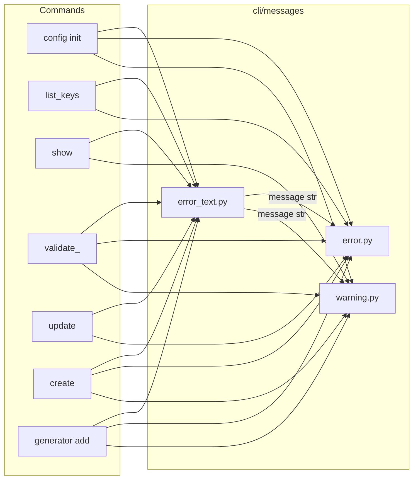

# CLI messages

The `src/repoman/cli/messages` package centralizes user-facing error and warning text and how it is rendered (error and warning panels). Commands obtain message strings from the message helpers and pass them to `error_panel` or `warning_panel`; they should not build these strings inline.

## Data flow

Commands get message text from the **error_text** helpers and pass it to the **panel** builders. The panel builders (`error.py`, `warning.py`) handle styling and layout only.

## Module roles

- **error_text.py** — Pure functions that return message strings (e.g. `answers_file_not_found(path)`, `schema_not_found()`, `file_exists_use_force(path)`). No Rich types; no console. Used for both error and warning content; the same helpers can be passed to `error_panel` or `warning_panel` depending on context.
- **error.py** — `error_panel(message, console=...)` builds a red-bordered panel with title "Error". Use it with any string (typically from `error_text`).
- **warning.py** — `warning_panel(message, console=...)` builds a yellow-bordered panel with title "Warning". Use it with any string (typically from `error_text`).
- **layout.py** — Layout utilities for multi-panel output. `use_layout(console, min_width=100)` returns `True` when the console is wide enough for Layout-based output; otherwise commands fall back to single-panel output. Used by `success.py`, `dry_run.py`, and some config commands.

## Usage

Commands should:

1. Import the needed helpers and panels from `repoman.cli.messages` (e.g. `error_panel`, `answers_file_not_found`, `file_exists_use_force`).
2. Build the message with the helper: `msg = answers_file_not_found(path)`.
3. Print the panel: `console.print(error_panel(msg, console=console))` or `console.print(warning_panel(msg, console=console))`.

Do not build error or warning message strings inline in commands; use the helpers in `error_text.py` so wording stays consistent and changes happen in one place.

## Layout vs Panel

On wide terminals (default `console.width >= 100`), several message helpers return a Rich `Layout` instead of a single `Panel`:

- **project_created**, **project_updated** — Two-panel layout: summary and next steps (left), copier options JSON (right).
- **dry_run_create**, **dry_run_update** — Same two-panel pattern for dry-run output.
- **command_created** — Two-panel when `summary_section` and `next_steps_section` are provided (generator add, config init).
- **dry_run_command_add** — Two-panel: summary + paths (left), template context (right).
- **config validate** (on failure) — Three-panel: missing keys, extra keys, type errors.
- **config show** (full template) — Summary header + YAML content in a panel.
- **debug_info** — Header + packages and environment variables side-by-side.

On narrow terminals or when output is piped (`console.width` is `None` or `< min_width`), these helpers fall back to single-panel output so the result is not cramped.
