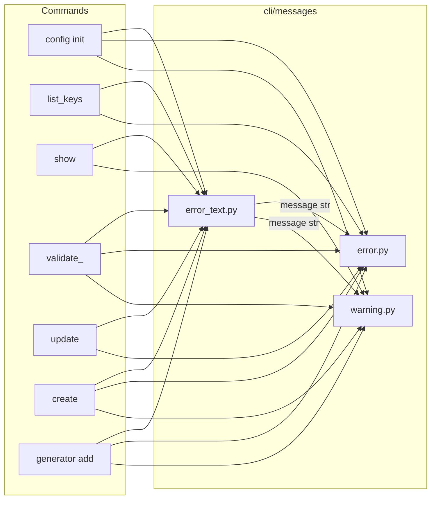

# CLI messages

The `src/repoman/cli/messages` package centralizes user-facing error and warning text and how it is rendered (error and warning panels). Commands obtain message strings from the message helpers and pass them to `error_panel` or `warning_panel`; they should not build these strings inline.

## Data flow

Commands get message text from the **error_text** helpers and pass it to the **panel** builders. The panel builders (`error.py`, `warning.py`) handle styling and layout only.

## Module roles

- **error_text.py** — Pure functions that return message strings (e.g. `answers_file_not_found(path)`, `schema_not_found()`, `file_exists_use_force(path)`). No Rich types; no console. Used for both error and warning content; the same helpers can be passed to `error_panel` or `warning_panel` depending on context.
- **error.py** — `error_panel(message, console=...)` builds a red-bordered panel with title "Error". Use it with any string (typically from `error_text`).
- **warning.py** — `warning_panel(message, console=...)` builds a yellow-bordered panel with title "Warning". Use it with any string (typically from `error_text`).

## Usage

Commands should:

1. Import the needed helpers and panels from `repoman.cli.messages` (e.g. `error_panel`, `answers_file_not_found`, `file_exists_use_force`).
2. Build the message with the helper: `msg = answers_file_not_found(path)`.
3. Print the panel: `console.print(error_panel(msg, console=console))` or `console.print(warning_panel(msg, console=console))`.

Do not build error or warning message strings inline in commands; use the helpers in `error_text.py` so wording stays consistent and changes happen in one place.
