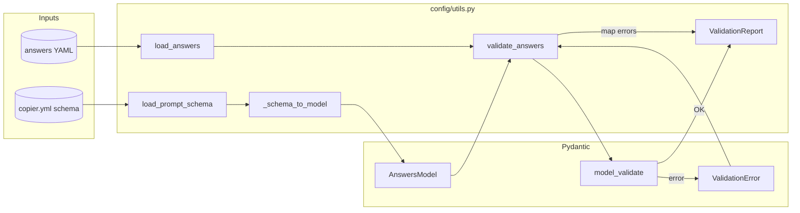

# Config validation

The `repoman config validate` command checks `.copier-answers.yml` (or another answers file) against the repoman template schema (`copier.yml`). Validation is implemented with Pydantic: the schema is turned into a dynamic model, answers are validated against it, and any errors are mapped to a `ValidationReport`.

## Data flow



## Flow description

1. **Load schema** — `load_prompt_schema()` reads `copier.yml` and extracts prompt keys and metadata (type, choices, etc.).

2. **Build model** — `_schema_to_model(schema, strict)` creates a Pydantic model dynamically:
   - Each prompt key becomes a required field.
   - Types: `str`, `bool`, `int` from schema `type`.
   - `choices` (list or dict) become `Literal` types.
   - `strict=True` sets `extra="forbid"` so unknown keys are rejected.

3. **Validate** — `validate_answers(schema, answers, strict=...)` calls `model.model_validate(answers)`.

4. **Error mapping** — On `ValidationError`, errors are mapped to `ValidationReport`:
   - `missing` / `value_error.missing` → `missing_keys`
   - `extra_forbidden` / `value_error.extra` → `extra_keys`
   - Other errors (wrong type, invalid choice) → `type_errors`

## Module roles

- **load_prompt_schema()** — Reads `copier.yml` and returns the prompt schema dict (no `_` meta keys).
- **load_answers(path)** — Loads answers from a YAML file; raises `FileNotFoundError` or `yaml.YAMLError` on failure.
- **_schema_to_model(schema, strict)** — Builds a Pydantic model from the schema. Private helper.
- **validate_answers(schema, answers, strict=False)** — Validates answers against the schema and returns a `ValidationReport`.

## ValidationReport

| Field        | Description                                                |
|-------------|------------------------------------------------------------|
| `valid`     | `True` if validation passed; `False` otherwise.           |
| `missing_keys` | Sorted list of required keys that are missing.         |
| `extra_keys`   | Sorted list of unknown keys (only when `strict=True`). |
| `type_errors`  | Human-readable type/choice error messages.             |

## Usage

```python
from pathlib import Path
from repoman.cli.commands.config.utils import (
    load_prompt_schema,
    load_answers,
    validate_answers,
)

schema = load_prompt_schema()
answers_path = Path(".copier-answers.yml")
answers = load_answers(answers_path)
report = validate_answers(schema, answers, strict=False)

if report.valid:
    print("Validation passed")
else:
    if report.missing_keys:
        print("Missing:", report.missing_keys)
    if report.extra_keys:
        print("Extra:", report.extra_keys)
    for err in report.type_errors:
        print(err)
```
