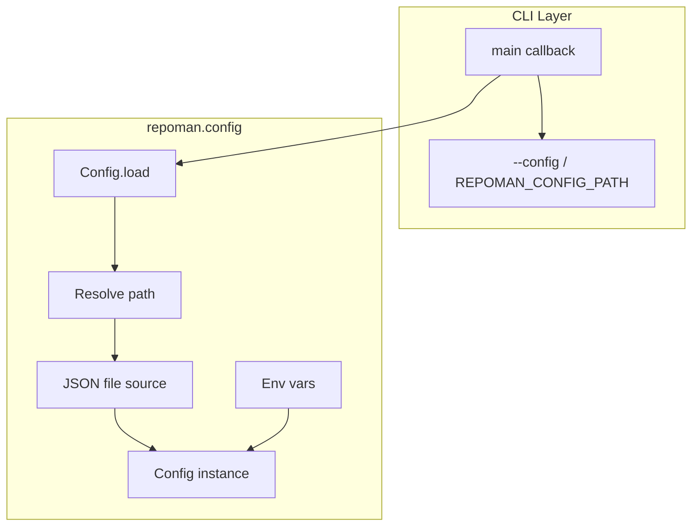

# Configuration

For **development environment** setup (environment variables, IDE), see [Development configuration](../development/configuration.md).

This page describes **project configuration**: the answers file, non-interactive use, defaults, and where they are stored.

## Repoman application configuration

Repoman loads system-wide configuration from a JSON file. Use this to customize repoman's behavior (e.g. log format).

### Config file location

| Platform   | Default path                                  |
| ---------- | ---------------------------------------------- |
| Linux/macOS| `~/.config/repoman/config.json`                |
| Windows    | `%APPDATA%\repoman\config.json`                |

On Linux and macOS, `$XDG_CONFIG_HOME` is respected when set (defaults to `~/.config`). On Windows, `%APPDATA%` is used (typically `~/AppData/Roaming`).

### Hierarchical config

When running repoman from within a project directory, you can override global config with project-level settings. Create `.repoman/config.json` in your project root:

```json
{
  "log_format": "%(levelname)s: %(message)s"
}
```

Project values override global for overlapping keys. Use `load_hierarchical(project_dir=Path("."))` programmatically to load merged config when running from within a project.

### Overriding the config path

- **`--config` / `-c`**: Pass a path on the command line.
- **`REPOMAN_CONFIG_PATH`**: Set this environment variable to a custom config file path.

Example:

```bash
repoman --config ~/my-repoman-config.json create ...
REPOMAN_CONFIG_PATH=/etc/repoman/config.json repoman create ...
```

### Config file format

Create `~/.config/repoman/config.json` (or your custom path) with:

```json
{
  "log_format": "%(asctime)s - %(name)s - %(levelname)s - %(message)s"
}
```

### Environment overrides

Environment variables override values from the config file. Use the `REPOMAN_` prefix:

- **`REPOMAN_LOG_FORMAT`**: Override the log format string.

Example:

```bash
REPOMAN_LOG_FORMAT="%(levelname)s: %(message)s" repoman create ...
```

### Config load flow



---

## Configuration = answers

For generated projects, **configuration** is the set of **answers** to the template prompts (project name, author, CI, optional FastAPI or dataset support, etc.). Those answers drive what gets generated.

## Where configuration is stored

Answers are stored in **`.copier-answers.yml`** in the **generated project** directory (the project you created with `repoman create` or that you update with `repoman update`). That file is created the first time you run `repoman create` and is updated when you run `repoman update` (and when you change answers interactively or via `--answers`).

## Generating an answers file

To get a template answers file that you can edit and reuse (e.g. for non-interactive runs), use:

```bash
repoman config init --output path/to/.copier-answers.yml
```

If you omit `--output`, the file is written as `.copier-answers.yml` in the current directory. Edit the file with your project values, then pass it to `repoman create --answers`. See the [CLI reference](../cli.md#config) for options (`--force`, `--template`).

## Validating an answers file

To check that an answers file has all required keys and correct types (e.g. before running in CI), use:

```bash
repoman config validate --answers path/to/.copier-answers.yml
```

Use `--strict` to also fail if the file contains extra keys not in the template schema. Use `--quiet` to only rely on the exit code (0 = valid, 1 = invalid).

## Inspecting prompt keys

To list the prompt keys the template expects (from `copier.yml`), use:

```bash
repoman config list-keys
```

Use `--format json` for machine-readable output, or `--include-meta` to show type, default, and `when` conditions for each key. To print the full bundled template (or a single key's value), use `repoman config show`; see the [CLI reference](../cli.md#config-show).

## Non-interactive use

To run repoman without prompts (e.g. in CI or scripts), pass an answers file:

```bash
repoman create --project_name my-project --answers path/to/.copier-answers.yml
repoman update ./my-project --answers ./my-project/.copier-answers.yml
```

The file must contain the same prompt keys and values that the template expects. See [Template prompts](../template-prompts.md) for the full list of prompts and defaults.

## Defaults

Defaults are defined in the template (in `src/repoman/copier.yml` and the template logic). If you do not provide an answer (e.g. you press Enter at a prompt), the template’s default is used. When using `--answers`, any key you omit falls back to the template default.

For the list of prompts and their defaults, see [Template prompts](../template-prompts.md). For how answers are used on update, see [Copier and answers](../concepts/copier-and-answers.md).
